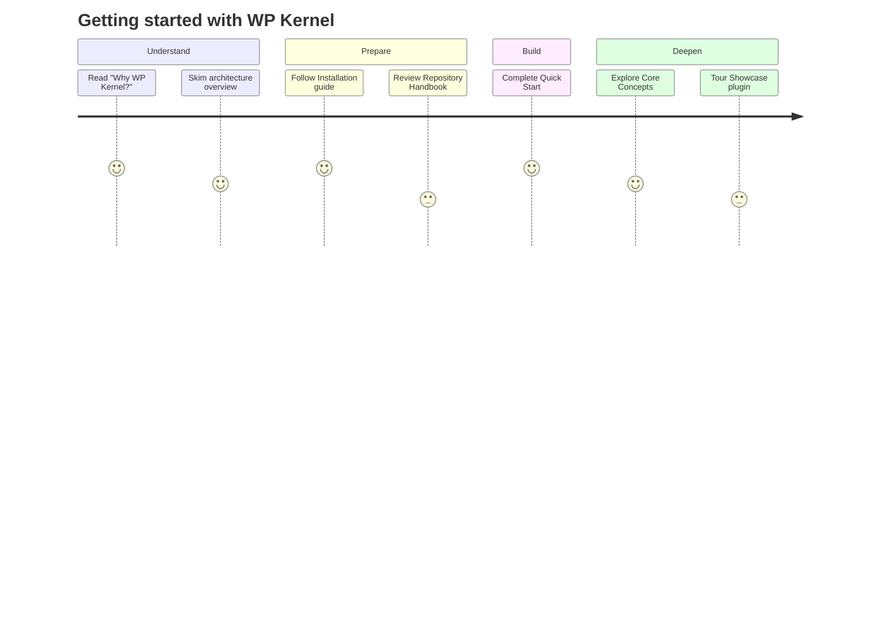

# Introduction

WP Kernel is a Rails-like, opinionated framework for building modern WordPress products where **JavaScript remains the source of truth** and **PHP provides a focused contract** for transport and capabilities. Instead of wiring the same state and networking layer on every project, you inherit a set of conventions that already know how the pieces should work together.

## What this is (in plain language)

Think of WP Kernel as a small backbone for 2025-era WordPress development. Blocks, bindings, and the Interactivity API power the UI. Actions coordinate every write. Resources speak REST with types and caching baked in. The PHP bridge exposes only the endpoints you need for legacy compatibility. You focus on product behaviour; the kernel keeps the plumbing predictable.

### Orientation map



Move through the materials in that order: orient yourself, set up the environment, build something small, then deepen your understanding with the guides.

## Core philosophy

### Actions-first rule

User interfaces never call transport directly. Every mutation passes through an Action that can validate permissions, coordinate retries, emit events, and invalidate caches. Compare the two approaches below; the first creates invisible data debt, the second leaves a clear audit trail.

```typescript
// ❌ WRONG - UI calling resource directly
const handleSubmit = async () => {
	await thing.create(formData); // Lint error + runtime warning
};

// ✅ CORRECT - UI calls Action
import { CreateThing } from '@/app/actions/Thing/Create';
const handleSubmit = async () => {
	await CreateThing({ data: formData });
};
```

### Read path vs write path

On the read side, views ask bindings for data, bindings reach into the store, and resources populate the cache. On the write side, the same views trigger Actions, which call resources, emit canonical events, and handle invalidation. Keeping the paths distinct is what allows WP Kernel to add logging, retries, and job queues without touching your components.

```typescript
// Client-side binding
registerBindingSource('gk', {
	'thing.title': (attrs) => select('wpk/thing').getById(attrs.id)?.title,
});
```

```typescript
export const CreateThing = defineAction('Thing.Create', async ({ data }) => {
	const created = await thing.create(data);
	CreateThing.emit(events.thing.created, { id: created.id });
	invalidate(['thing', 'list']);
	return created;
});
```

## Who benefits

Developers get a single mental model across the editor, front end, and admin. Agencies and product teams gain delivery discipline without hand-written boilerplate. Business owners see faster iteration because the architecture already accounts for extensibility, telemetry, and background processing.

## What it enables

Imagine the kickoff task: “Add an Apply button that creates an application, shows a toast, and moves a card on the admin board.” With WP Kernel you scaffold an `application` resource, implement an `Application.Submit` Action that handles permissions and emits the canonical event, bind a button to the Action in the block editor, and-if required-mirror the event in PHP so downstream systems can react. The boring decisions are already made, which shortens time to value from days to minutes.

## How it fits with WordPress Core

Nothing here fights core WordPress. WP Kernel leans on Script Modules for ESM, `@wordpress/data` for state, Block Bindings for content, the Interactivity API for behaviour, and `@wordpress/hooks` for events. By staying close to Core, you invest in skills and APIs that the broader ecosystem shares.

## Key guarantees

Actions remain the only sanctioned write path. JavaScript hooks are the canonical source of truth and the PHP bridge mirrors only selected events. Resources derive their types from JSON Schema, which keeps the contracts honest. Event names stay stable across major versions, cache invalidation is explicit, and every error extends `KernelError` so logging and telemetry see a consistent structure.

## Next steps

When you are ready to dive in, start with the [installation guide](/getting-started/installation) to prepare your tooling. Move on to the [Quick Start](/getting-started/quick-start) to build a feature end to end. The [Repository Handbook](/guide/repository-handbook) points you to project-level documents like `DEVELOPMENT.md`, and the broader [Core Concepts](/guide/) section unpacks Actions, resources, events, bindings, and jobs in depth.
