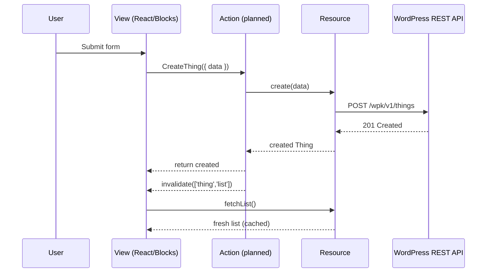

# Quick Start

This tutorial shows how a single feature flows through WP Kernel—from declaring a resource to wiring a form. The narrative mirrors the style of WordPress developer docs: short steps, rationale at every turn, and diagrams for mental models.

## Goal

By the end you will have:

- A typed REST resource
- A (planned) Action orchestrator that wraps writes
- A UI form that submits data through the Action
- A PHP endpoint that fulfils the contract

Time to complete: **about 15 minutes**.

### How the flow fits together



## Step 1: Define a Resource

Resources capture your data contract and generate a typed client, store bindings, and cache keys. Create `app/resources/Thing.ts`:

```typescript
import { defineResource } from '@geekist/wp-kernel/resource';

export interface Thing {
	id: number;
	title: string;
	description: string;
	created_at: string;
}

export const thing = defineResource<Thing, { q?: string }>({
	name: 'thing',
	routes: {
		list: { path: '/wpk/v1/things', method: 'GET' },
		get: { path: '/wpk/v1/things/:id', method: 'GET' },
		create: { path: '/wpk/v1/things', method: 'POST' },
	},
	schema: import('../../contracts/thing.schema.json'),
	cacheKeys: {
		list: (q) => ['thing', 'list', q?.q],
		get: (id) => ['thing', 'get', id],
	},
});
```

**Why this matters**

- You now have typed methods such as `thing.fetchList()`, `thing.fetch(id)`, and `thing.create(data)`
- Store selectors (`thing.useList`, `thing.useGet`) and cache helpers (`thing.invalidate`) come for free
- JSON Schema keeps the TypeScript model and REST payload in sync

## Step 2: Create JSON Schema

Create `contracts/thing.schema.json` to formalise the API contract and feed type generation:

```json
{
	"$schema": "http://json-schema.org/draft-07/schema#",
	"type": "object",
	"properties": {
		"id": { "type": "number" },
		"title": { "type": "string", "minLength": 1, "maxLength": 200 },
		"description": { "type": "string", "maxLength": 1000 },
		"created_at": { "type": "string", "format": "date-time" }
	},
	"required": ["id", "title", "created_at"]
}
```

Generate types so the client and server stay aligned:

```bash
pnpm types:generate
```

## Step 3: Sketch the Action orchestrator

::: info Planned module
`defineAction` ships with the upcoming Actions sprint. The example below shows the intended usage so you can structure your code today. Keep the file in place—once the module lands you will simply wire the real import.
:::

Actions own the write path: they call the resource, emit events, invalidate caches, and return the result. Create `app/actions/Thing/Create.ts`:

```typescript
import { defineAction } from '@geekist/wp-kernel/action';
import { events } from '@geekist/wp-kernel/events';
import { invalidate } from '@geekist/wp-kernel';
import { thing } from '@/app/resources/Thing';

export const CreateThing = defineAction(
	'Thing.Create',
	async ({ data }: { data: Partial<Thing> }) => {
		const created = await thing.create(data);

		CreateThing.emit(events.thing.created, {
			id: created.id,
			data: created,
		});

		invalidate(['thing', 'list']);

		return created;
	}
);
```

**Why this matters**

- Centralises permissions, retries, job queuing, and analytics
- Guarantees cache invalidation happens with every mutation
- Emits canonical events (`{namespace}.thing.created`) for extensions and telemetry

## Step 4: Bind data to the UI

Use the generated hooks to show data and the Action to mutate it. Create `app/views/Thing/Form.tsx`:

```tsx
import { useState } from '@wordpress/element';
import { Button, Notice, TextControl } from '@wordpress/components';
import { thing } from '@/app/resources/Thing';
import { CreateThing } from '@/app/actions/Thing/Create';

export function ThingForm() {
	const { data: list, isLoading } = thing.useList();
	const [title, setTitle] = useState('');
	const [description, setDescription] = useState('');
	const [saving, setSaving] = useState(false);
	const [error, setError] = useState<string | null>(null);

	const handleSubmit = async (event: React.FormEvent) => {
		event.preventDefault();
		setSaving(true);
		setError(null);

		try {
			await CreateThing({ data: { title, description } });
			setTitle('');
			setDescription('');
		} catch (err) {
			setError((err as Error).message);
		} finally {
			setSaving(false);
		}
	};

	return (
		<form onSubmit={handleSubmit}>
			{error && (
				<Notice status="error" isDismissible={false}>
					{error}
				</Notice>
			)}

			<TextControl
				label="Title"
				value={title}
				onChange={setTitle}
				required
			/>

			<TextControl
				label="Description"
				value={description}
				onChange={setDescription}
			/>

			<Button type="submit" variant="primary" isBusy={saving}>
				Create Thing
			</Button>

			<section aria-live="polite" style={{ marginTop: '1rem' }}>
				{isLoading && <p>Loading things…</p>}
				{!isLoading && list?.items?.length ? (
					<ul>
						{list.items.map((item) => (
							<li key={item.id}>{item.title}</li>
						))}
					</ul>
				) : (
					!isLoading && <p>No things yet.</p>
				)}
			</section>
		</form>
	);
}
```

The component always reads via `thing.useList()` and writes via `CreateThing`. ESLint rules (and later runtime guards) prevent direct transport access from the view.

## Step 5: Provide the REST endpoint (PHP)

Create `includes/rest/class-things-controller.php` so WordPress fulfils the contract:

```php
<?php
namespace Geekist\WPKernel\REST;

class Things_Controller extends \WP_REST_Controller {
    protected $namespace = 'wpk/v1';
    protected $rest_base = 'things';

    public function register_routes() {
        register_rest_route( $this->namespace, '/' . $this->rest_base, [
            [
                'methods'             => \WP_REST_Server::READABLE,
                'callback'            => [ $this, 'get_items' ],
                'permission_callback' => [ $this, 'get_items_permissions_check' ],
            ],
            [
                'methods'             => \WP_REST_Server::CREATABLE,
                'callback'            => [ $this, 'create_item' ],
                'permission_callback' => [ $this, 'create_item_permissions_check' ],
                'args'                => $this->get_endpoint_args_for_item_schema(),
            ],
        ] );
    }

    public function get_items_permissions_check( $request ) {
        return current_user_can( 'edit_posts' );
    }

    public function create_item_permissions_check( $request ) {
        return current_user_can( 'edit_posts' );
    }

    public function get_items( $request ) {
        // TODO: Replace with real persistence
        return rest_ensure_response( [
            'items' => [],
            'headers' => [],
        ] );
    }

    public function create_item( $request ) {
        $params = $request->get_json_params();

        $thing = [
            'id'          => wp_generate_uuid4(),
            'title'       => sanitize_text_field( $params['title'] ),
            'description' => sanitize_textarea_field( $params['description'] ?? '' ),
            'created_at'  => current_time( 'c' ),
        ];

        return rest_ensure_response( $thing );
    }
}
```

Register the controller inside your plugin bootstrap:

```php
add_action( 'rest_api_init', function() {
    $controller = new \Geekist\WPKernel\REST\Things_Controller();
    $controller->register_routes();
} );
```

## Step 6: Verify the loop

1. Build the workspace: `pnpm build`
2. Start WordPress: `pnpm wp:start`
3. Load http://localhost:8888 and submit the form
4. Confirm the UI updates (list shows the new item)
5. Inspect the console for the `wpk.thing.created` event payload
6. Optional: run `await thing.fetchList()` in the browser console to confirm the cache refresh

## Step 7: Continue exploring

- [Core Concepts](/guide/) — deeper explanations of Resources, Actions, Events, Jobs, and Bindings
- [Resources Guide](/guide/resources) — thin-flat vs grouped APIs, cache management, selectors
- [Repository Handbook](/guide/repository-handbook) — maps project documentation such as `DEVELOPMENT.md`
- [Showcase tour](/guide/showcase) — see the complete kernel in action

::: tip Need more context?
Check `DEVELOPMENT.md` in the repository root for environment tips, and `BRANCHING_STRATEGY.md` for collaboration flow. Both are linked from the Repository Handbook.
:::
