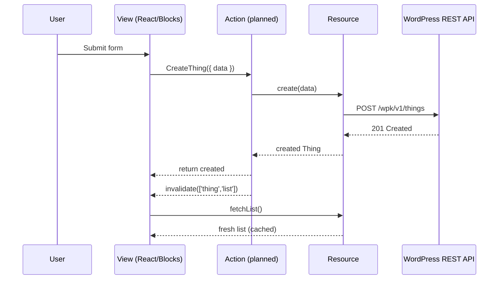

# Quick Start

This tutorial walks through a single feature from empty folder to working interface. We follow the pacing of WordPress developer handbooks: small, digestible steps, plenty of context, and diagrams that anchor the mental model. Expect to touch TypeScript, JSON Schema, React, and a small PHP bridge while keeping the narrative focused on why each move matters.

## What you will build

By the end you will have a "Thing" catalog. The feature includes a typed REST resource, a future-facing Action that will own writes, a form that reads from the generated store hooks, and a PHP controller that fulfils the contract. Each piece layers on the previous one so the journey makes sense even if you have never seen the repository before.

Time to complete: **about 15 minutes**.

### How the flow fits together



## Step 1: Declare the data contract

Resources are the heart of WP Kernel. They describe how the front end talks to WordPress, and from that single definition we generate hooks, cache keys, and strongly typed clients. Create `app/resources/Thing.ts` and begin with the TypeScript interface so future readers instantly understand the shape of the data:

```typescript
export interface Thing {
	id: number;
	title: string;
	description: string;
	created_at: string;
}
```

Once the shape is in place, pull in `defineResource` and wire the REST endpoints you expect the server to expose:

```typescript
import { defineResource } from '@geekist/wp-kernel/resource';

export const thing = defineResource<Thing, { q?: string }>({
	name: 'thing',
	routes: {
		list: { path: '/wpk/v1/things', method: 'GET' },
		get: { path: '/wpk/v1/things/:id', method: 'GET' },
		create: { path: '/wpk/v1/things', method: 'POST' },
	},
	schema: import('../../contracts/thing.schema.json'),
	cacheKeys: {
		list: (q) => ['thing', 'list', q?.q],
		get: (id) => ['thing', 'get', id],
	},
});
```

A single resource gives you typed methods (`thing.fetchList()`, `thing.create(data)`), generated store hooks (`thing.useList()`), and predictable cache invalidation helpers. That keeps the remainder of the tutorial short: we lean on the resource rather than hand-rolled fetch calls.

## Step 2: Back the resource with JSON Schema

TypeScript alone cannot protect a REST endpoint. JSON Schema keeps the JavaScript client and the PHP controller honest. Save the contract as `contracts/thing.schema.json`:

```json
{
	"$schema": "http://json-schema.org/draft-07/schema#",
	"type": "object",
	"properties": {
		"id": { "type": "number" },
		"title": { "type": "string", "minLength": 1, "maxLength": 200 },
		"description": { "type": "string", "maxLength": 1000 },
		"created_at": { "type": "string", "format": "date-time" }
	},
	"required": ["id", "title", "created_at"]
}
```

Run `pnpm types:generate` to regenerate the resource typings. Whenever schema changes, rerun the command and the generated API docs stay in sync-no drift between prose and implementation.

## Step 3: Sketch the Action orchestrator

`defineAction` ships with the upcoming Actions sprint. We still create the file today because it documents intent, and when the module lands you only swap the import. Actions centralise writes: they call the resource, emit events, invalidate caches, and return structured errors.

Create `app/actions/Thing/Create.ts` with the planned API:

```typescript
import { defineAction } from '@geekist/wp-kernel/actions';
import { events } from '@geekist/wp-kernel/events';
import { invalidate } from '@geekist/wp-kernel';
import { thing, Thing } from '@/app/resources/Thing';
```

With the imports ready, describe the orchestration logic:

```typescript
export const CreateThing = defineAction(
	'Thing.Create',
	async ({ data }: { data: Partial<Thing> }) => {
		const created = await thing.create(data);

		CreateThing.emit(events.thing.created, {
			id: created.id,
			data: created,
		});

		invalidate(['thing', 'list']);

		return created;
	}
);
```

The planned file captures three responsibilities in plain English: send the write through the resource, announce success through the canonical event registry, and mark caches as stale so views re-render with fresh data. Even before Actions ship, teammates understand the intended structure and WordPress reviewers can see where permissions and analytics will live.

## Step 4: Bind data to the UI

Views consume the generated hooks and call Actions; they never talk to transport directly. A small form is enough to demonstrate the pattern. Create `app/views/Thing/Form.tsx` and start with imports and local state:

```tsx
import { useState } from '@wordpress/element';
import { Button, Notice, TextControl } from '@wordpress/components';
import { thing } from '@/app/resources/Thing';
import { CreateThing } from '@/app/actions/Thing/Create';

export function ThingForm() {
        const { data: list, isLoading } = thing.useList();
        const [title, setTitle] = useState('');
        const [description, setDescription] = useState('');
        const [saving, setSaving] = useState(false);
        const [error, setError] = useState<string | null>(null);
```

Handle submission by calling the Action and relying on its invariants:

```tsx
const handleSubmit = async (event: React.FormEvent) => {
	event.preventDefault();
	setSaving(true);
	setError(null);

	try {
		await CreateThing({ data: { title, description } });
		setTitle('');
		setDescription('');
	} catch (err) {
		setError((err as Error).message);
	} finally {
		setSaving(false);
	}
};
```

Render the form and a basic list preview:

```tsx
        return (
                <form onSubmit={handleSubmit}>
                        {error && (
                                <Notice status="error" isDismissible={false}>
                                        {error}
                                </Notice>
                        )}

                        <TextControl
                                label="Title"
                                value={title}
                                onChange={setTitle}
                                required
                        />

                        <TextControl
                                label="Description"
                                value={description}
                                onChange={setDescription}
                        />

                        <Button type="submit" variant="primary" isBusy={saving}>
                                Create Thing
                        </Button>

                        <section aria-live="polite" style={{ marginTop: '1rem' }}>
                                {isLoading && <p>Loading things…</p>}
                                {!isLoading && list?.items?.length ? (
                                        <ul>
                                                {list.items.map((item) => (
                                                        <li key={item.id}>{item.title}</li>
                                                ))}
                                        </ul>
                                ) : (
                                        !isLoading && <p>No things yet.</p>
                                )}
                        </section>
                </form>
        );
}
```

Two points stand out. First, the component trusts the resource hook to memoise and refetch. Second, the Action manages cache invalidation, so the list reflects new items without manual state juggling.

## Step 5: Provide the REST endpoint (PHP)

WordPress still needs an endpoint that respects the schema. The PHP bridge stays thin: register routes, hand off to REST callbacks, and sanitise input. Create `includes/rest/class-things-controller.php`:

```php
<?php
namespace Geekist\WPKernel\REST;

class Things_Controller extends \WP_REST_Controller {
    protected $namespace = 'wpk/v1';
    protected $rest_base = 'things';

    public function register_routes() {
        register_rest_route( $this->namespace, '/' . $this->rest_base, [
            [
                'methods'             => \WP_REST_Server::READABLE,
                'callback'            => [ $this, 'get_items' ],
                'permission_callback' => [ $this, 'get_items_permissions_check' ],
            ],
            [
                'methods'             => \WP_REST_Server::CREATABLE,
                'callback'            => [ $this, 'create_item' ],
                'permission_callback' => [ $this, 'create_item_permissions_check' ],
                'args'                => $this->get_endpoint_args_for_item_schema(),
            ],
        ] );
    }
```

Add simple permission checks so the tutorial communicates where authorisation belongs:

```php
    public function get_items_permissions_check( $request ) {
        return current_user_can( 'edit_posts' );
    }

    public function create_item_permissions_check( $request ) {
        return current_user_can( 'edit_posts' );
    }
```

Return placeholder data for now; production code would persist to the database:

```php
    public function get_items( $request ) {
        return rest_ensure_response( [
            'items' => [],
            'headers' => [],
        ] );
    }
```

Finally, accept input, sanitise it, and return a response that matches the schema:

```php
    public function create_item( $request ) {
        $params = $request->get_json_params();

        $thing = [
            'id'          => wp_generate_uuid4(),
            'title'       => sanitize_text_field( $params['title'] ),
            'description' => sanitize_textarea_field( $params['description'] ?? '' ),
            'created_at'  => current_time( 'c' ),
        ];

        return rest_ensure_response( $thing );
    }
}
```

Register the controller from your plugin bootstrap:

```php
add_action( 'rest_api_init', function() {
    $controller = new \Geekist\WPKernel\REST\Things_Controller();
    $controller->register_routes();
} );
```

## Step 6: Verify the loop end to end

Build the workspace with `pnpm build`, then start WordPress (`pnpm wp:start`) and load http://localhost:8888. Submit the form, watch the list update, and open the browser console to confirm a `wpk.thing.created` event fired. For extra confidence, run `await thing.fetchList()` in the console: the hook refetches because the Action invalidated its cache key.

## Step 7: Continue exploring

Keep going while the context is fresh. The [Core Concepts](/guide/) section expands on resources, Actions, events, and bindings. The [Repository Handbook](/guide/repository-handbook) points to project-level documents such as `DEVELOPMENT.md`, so you know where to learn about tooling and conventions. When you are ready for a larger example, the [Showcase tour](/guide/showcase) dissects a feature-complete plugin built on WP Kernel.

::: tip Need more context?
`DEVELOPMENT.md` (repository root) covers environment setup, and `BRANCHING_STRATEGY.md` explains collaboration workflows. Both live in the handbook for easy discovery.
:::
