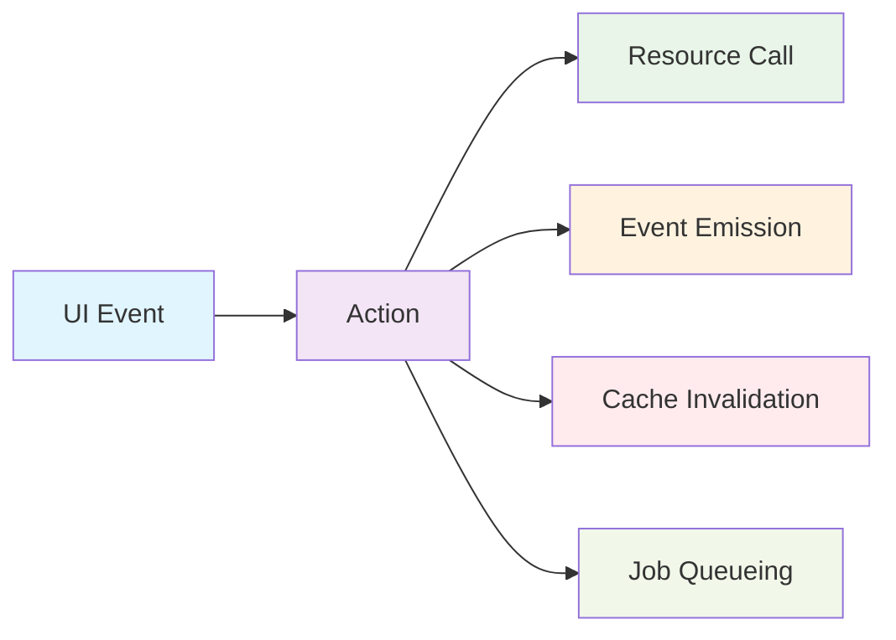

# Actions

Actions are the **conductors of your WordPress application**. They orchestrate every write operation, ensuring consistency, reliability, and extensibility. Think of them as the difference between chaos and harmony in a complex system.

## Why Actions Matter

In traditional WordPress development, you might see code like this scattered throughout themes and plugins:

```php
// Scattered, inconsistent write operations
wp_insert_post($data);
wp_cache_delete('posts_list');
do_action('post_created', $post_id);
wp_schedule_single_event(time() + 300, 'send_notification', [$post_id]);
```

WP Kernel Actions bring **predictability and coordination** to this process:

```typescript
// Coordinated, predictable, testable
await CreatePost({ title: 'Hello World', content: 'First post!' });
// ✅ Resource called
// ✅ Events emitted
// ✅ Cache invalidated
// ✅ Jobs queued
// ✅ All side effects handled
```

## The Actions-First Philosophy



**The Golden Rule**: UI components **never** call resource write methods directly. Always route through Actions.

This isn't just a suggestion—it's the foundation that makes everything else possible:

- **Consistent side effects**: Every write operation follows the same pattern
- **Automatic event emission**: Other parts of your app can react to changes
- **Smart cache invalidation**: UI stays fresh without manual work
- **Background job coordination**: Long-running tasks don't block the user
- **Audit trails**: Every action is trackable and debuggable

## Anatomy of an Action

Let's build up an action step by step to see how it all fits together:

### 1. Basic Structure

```typescript
import { defineAction } from '@geekist/wp-kernel/action';

export const CreatePost = defineAction({
	name: 'Post.Create',
	async execute({ title, content }) {
		// Action logic goes here
	},
});
```

### 2. Add Resource Integration

```typescript
import { defineAction } from '@geekist/wp-kernel/action';
import { post } from '@/resources/post';

export const CreatePost = defineAction({
	name: 'Post.Create',
	async execute({ title, content }) {
		// Call the resource (this does the actual API work)
		const created = await post.create({ title, content });

		return created;
	},
});
```

### 3. Add Event Emission

```typescript
import { defineAction } from '@geekist/wp-kernel/action';
import { post } from '@/resources/post';
import { events } from '@geekist/wp-kernel/events';

export const CreatePost = defineAction({
	name: 'Post.Create',
	async execute({ title, content }) {
		const created = await post.create({ title, content });

		// Emit canonical events (automatic in many cases)
		events.emit('wpk.resource.post.created', {
			data: created,
			meta: { userId: getCurrentUserId() },
		});

		return created;
	},
});
```

### 4. Add Cache Invalidation

```typescript
import { defineAction } from '@geekist/wp-kernel/action';
import { post } from '@/resources/post';
import { events } from '@geekist/wp-kernel/events';

export const CreatePost = defineAction({
	name: 'Post.Create',
	async execute({ title, content }) {
		const created = await post.create({ title, content });

		events.emit('wpk.resource.post.created', {
			data: created,
			meta: { userId: getCurrentUserId() },
		});

		// Invalidate relevant cache keys (often automatic)
		post.cache.invalidate(['list']); // Post lists need to refresh

		return created;
	},
});
```

### 5. Add Background Jobs

```typescript
import { defineAction } from '@geekist/wp-kernel/action';
import { post } from '@/resources/post';
import { events } from '@geekist/wp-kernel/events';
import { jobs } from '@geekist/wp-kernel/jobs';

export const CreatePost = defineAction({
	name: 'Post.Create',
	async execute({ title, content, notifySubscribers = false }) {
		const created = await post.create({ title, content });

		events.emit('wpk.resource.post.created', {
			data: created,
			meta: { userId: getCurrentUserId() },
		});

		post.cache.invalidate(['list']);

		// Queue background work
		if (notifySubscribers) {
			await jobs.enqueue('SendPostNotification', {
				postId: created.id,
			});
		}

		return created;
	},
});
```

### 6. Add Error Handling & Validation

```typescript
import { defineAction } from '@geekist/wp-kernel/action';
import { post } from '@/resources/post';
import { events } from '@geekist/wp-kernel/events';
import { jobs } from '@geekist/wp-kernel/jobs';
import { KernelError } from '@geekist/wp-kernel/error';

export const CreatePost = defineAction({
	name: 'Post.Create',
	async execute({ title, content, notifySubscribers = false }) {
		// Validation
		if (!title?.trim()) {
			throw new KernelError('ValidationError', {
				message: 'Post title is required',
				field: 'title',
			});
		}

		// Permission check
		if (!currentUserCan('publish_posts')) {
			throw new KernelError('PermissionError', {
				message: 'You cannot create posts',
				capability: 'publish_posts',
			});
		}

		try {
			const created = await post.create({ title, content });

			events.emit('wpk.resource.post.created', {
				data: created,
				meta: { userId: getCurrentUserId() },
			});

			post.cache.invalidate(['list']);

			if (notifySubscribers) {
				await jobs.enqueue('SendPostNotification', {
					postId: created.id,
				});
			}

			return created;
		} catch (error) {
			// Emit error event for monitoring
			events.emit('wpk.action.error', {
				action: 'CreatePost',
				error: error.message,
				data: { title, content },
			});

			throw error;
		}
	},
});
```

## Using Actions in Your UI

Once you have an action, using it is simple and consistent:

### In React Components

```typescript
import { useAction } from '@geekist/wp-kernel-ui';
import { CreatePost } from '@/actions/CreatePost';

function PostForm() {
  const [createPost, { loading, error }] = useAction(CreatePost);

  const handleSubmit = async (formData) => {
    try {
      const newPost = await createPost(formData);
      // Success! UI automatically updates via cache invalidation
    } catch (err) {
      // Error handling
    }
  };

  return (
    <form onSubmit={handleSubmit}>
      {/* form fields */}
      <button disabled={loading}>
        {loading ? 'Creating...' : 'Create Post'}
      </button>
    </form>
  );
}
```

### In Block Editor

```typescript
import { CreatePost } from '@/actions/CreatePost';

// In your block's save or edit function
const handleCreatePost = async () => {
	await CreatePost({
		title: 'Generated from block',
		content: 'Block-generated content',
	});
};
```

### In Interactivity API

```typescript
import { store } from '@wordpress/interactivity';
import { CreatePost } from '@/actions/CreatePost';

store('my-plugin', {
	actions: {
		async createPost() {
			const { title, content } = context;
			await CreatePost({ title, content });
			// UI automatically updates via store integration
		},
	},
});
```

## Common Patterns

### Optimistic Updates

```typescript
export const UpdatePost = defineAction({
	name: 'Post.Update',
	async execute({ id, updates }) {
		// Optimistically update the cache first
		post.cache.setItem(id, { ...existingPost, ...updates });

		try {
			const updated = await post.update(id, updates);
			// Replace optimistic update with real data
			post.cache.setItem(id, updated);
			return updated;
		} catch (error) {
			// Revert optimistic update
			post.cache.setItem(id, existingPost);
			throw error;
		}
	},
});
```

### Batch Operations

```typescript
export const BulkDeletePosts = defineAction({
	name: 'Post.BulkDelete',
	async execute({ ids }) {
		const results = [];

		for (const id of ids) {
			try {
				await post.delete(id);
				results.push({ id, success: true });
			} catch (error) {
				results.push({ id, success: false, error: error.message });
			}
		}

		// Invalidate cache once at the end
		post.cache.invalidate(['list']);

		events.emit('wpk.bulk.operation.completed', {
			operation: 'delete',
			results,
		});

		return results;
	},
});
```

### Conditional Side Effects

```typescript
export const PublishPost = defineAction({
	name: 'Post.Publish',
	async execute({ id, scheduleNotifications = true }) {
		const updated = await post.update(id, { status: 'publish' });

		events.emit('wpk.resource.post.published', {
			data: updated,
			meta: { publishedAt: new Date() },
		});

		post.cache.invalidate(['list', 'featured']);

		// Conditional side effects based on post properties
		if (updated.featured && scheduleNotifications) {
			await jobs.enqueue('SendFeaturedPostNotification', { postId: id });
		}

		if (updated.categories.includes('breaking-news')) {
			await jobs.enqueue('SendBreakingNewsAlert', { postId: id });
		}

		return updated;
	},
});
```

## Why This Pattern Works

### For Developers

- **Predictable**: Every action follows the same pattern
- **Testable**: Mock at the action level for clean unit tests
- **Debuggable**: Clear flow from UI → Action → Side Effects
- **Reusable**: Actions can be called from anywhere (UI, CLI, jobs, etc.)

### For Users

- **Responsive**: Optimistic updates provide immediate feedback
- **Reliable**: Consistent error handling and recovery
- **Informed**: Events keep different parts of the app in sync

### For Teams

- **Consistent**: Everyone follows the same patterns
- **Maintainable**: Side effects are centralized and documented
- **Extensible**: Other developers can hook into events
- **Auditable**: All changes flow through trackable actions

## What's Next?

- **[UI Implementation Patterns](/packages/ui#implementation-patterns)** - Real-world examples with DataViews and admin interfaces
- **[CLI Generators](/packages/cli#generator-patterns)** - Scaffold complete CRUD actions automatically
- **[Events Guide](/guide/events)** - How actions coordinate with the rest of your app
- **[Jobs Guide](/guide/jobs)** - Background processing patterns
- **[Testing Actions](/contributing/testing#testing-actions)** - Unit and integration testing strategies

Actions are where the magic happens in WP Kernel. They're the bridge between user intent and system reality, ensuring every operation is predictable, reliable, and extensible.
