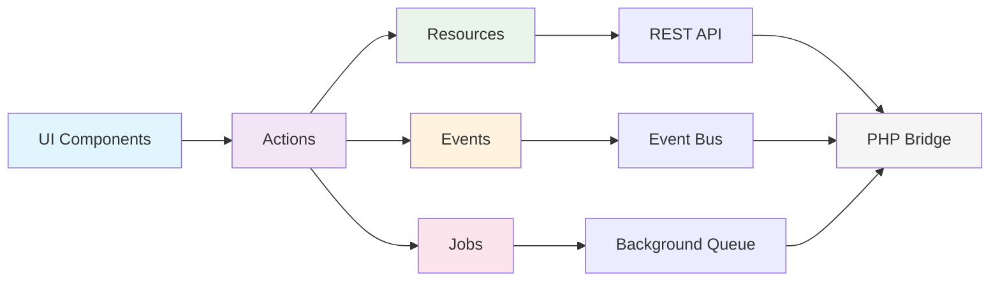
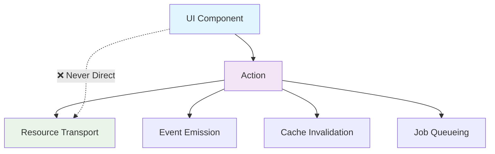
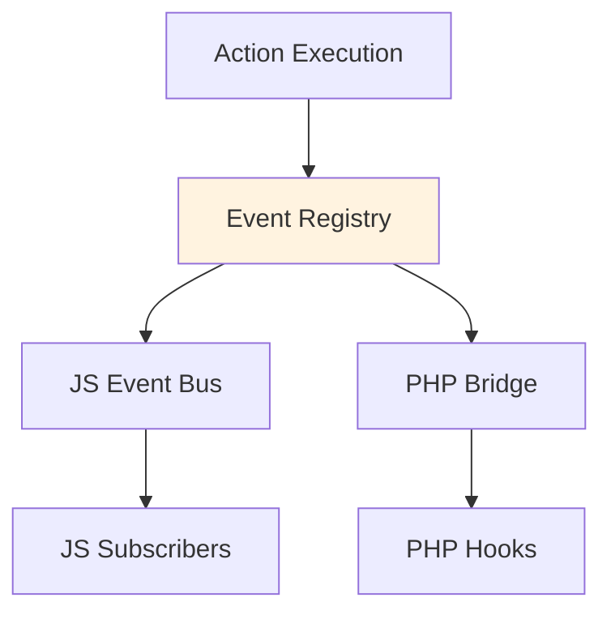
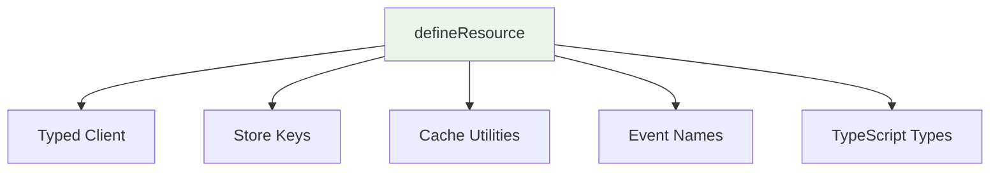
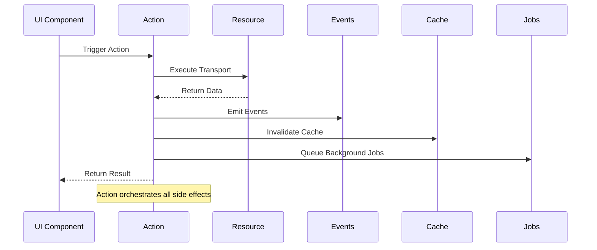
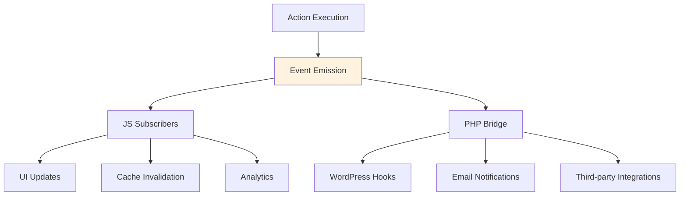

# Philosophy & Architecture

WP Kernel is built on a simple but powerful philosophy: **JavaScript is the source of truth, PHP is a thin contract**. This guide explains the core principles, mental models, and architectural decisions that make WP Kernel a Rails-like framework for modern WordPress development.

## Core Philosophy

### JavaScript-First, PHP-Thin

WordPress has evolved to be JavaScript-first with Gutenberg, Script Modules, and the Interactivity API. WP Kernel embraces this evolution completely:

- **JavaScript** owns business logic, state management, and user interactions
- **PHP** provides REST endpoints, capability checks, and optional server bindings
- **Bridge** connects the two worlds with a single, well-defined event system

### Convention Over Configuration

Like Rails, WP Kernel provides a "Golden Path" that covers 90% of use cases:

- Predictable folder structure
- Standardized naming conventions
- Automatic wiring of resources, actions, and events
- Sensible defaults with escape hatches for edge cases

## The Golden Path

The Golden Path is the mental model for building with WP Kernel. Every feature follows this flow:



### The Flow Explained

1. **UI Components** trigger user interactions
2. **Actions** orchestrate write operations (never called directly from UI)
3. **Resources** handle data transport and caching
4. **Events** notify other parts of the system
5. **Jobs** process background work
6. **PHP Bridge** provides REST endpoints and capabilities

## Core Principles

### 1. Actions-First Architecture

**Rule**: UI components NEVER call transport directly.



**Why**: This pattern ensures:

- Consistent event emission
- Automatic cache invalidation
- Coordinated side effects
- Testable write paths
- Audit trails for all changes

**Example**:

```typescript
// ❌ WRONG - UI calling transport directly
function SaveButton() {
	const handleSave = async () => {
		await postResource.update(id, data); // Direct call
	};
}

// ✅ CORRECT - UI triggering action
function SaveButton() {
	const handleSave = async () => {
		await UpdatePost({ id, data }); // Action orchestrates everything
	};
}
```

### 2. Canonical Event Taxonomy

**Rule**: All events use canonical names from a stable registry.



**Why**: This ensures:

- Stable API for integrations
- Predictable event names
- Version compatibility
- Clear documentation

**Example**:

```typescript
// ✅ Canonical event names
events.emit('wpk.resource.post.created', payload);
events.emit('wpk.cache.invalidated', { keys: ['post', 'list'] });

// ❌ Ad-hoc event names
events.emit('post-saved', payload);
events.emit('cache-cleared', payload);
```

### 3. Typed Resources

**Rule**: One resource definition creates everything you need.



**Why**: This provides:

- Single source of truth
- Automatic type generation
- Consistent caching strategy
- Coordinated event emission

**Example**:

```typescript
const post = defineResource({
	name: 'post',
	routes: {
		list: { path: '/wp/v2/posts', method: 'GET' },
		create: { path: '/wp/v2/posts', method: 'POST' },
	},
	// Everything else generated automatically
});

// ✅ Get typed client, cache keys, events, etc.
const posts = await post.list();
const cacheKey = post.cacheKeys.list({ status: 'publish' });
events.on('wpk.resource.post.created', handler);
```

### 4. WordPress-Native Building Blocks

**Rule**: Build on WordPress core primitives, don't replace them.

```mermaid
graph TD
    A[WP Kernel] --> B[Script Modules]
    A --> C[Block Bindings]
    A --> D[Interactivity API]
    A --> E[@wordpress/data]
    A --> F[REST API]

    B --> G[Modern JS Delivery]
    C --> H[Data-Driven Content]
    D --> I[Front-end Behavior]
    E --> J[State Management]
    F --> K[Data Transport]

    style A fill:#f3e5f5
```

**Why**: This ensures:

- WordPress compatibility
- Leverages core optimizations
- Reduces bundle size
- Future-proof architecture

## Mental Models

### The WordPress Data Stack

WP Kernel integrates seamlessly with WordPress's data architecture:

```mermaid
graph TB
    subgraph "Frontend"
        A[React Components]
        B[Block Bindings]
        C[Interactivity API]
    end

    subgraph "State Layer"
        D[@wordpress/data]
        E[WP Kernel Stores]
    end

    subgraph "Transport Layer"
        F[WP Kernel Resources]
        G[REST API]
    end

    subgraph "Backend"
        H[PHP Endpoints]
        I[WordPress Core]
    end

    A --> D
    B --> D
    C --> D
    D --> E
    E --> F
    F --> G
    G --> H
    H --> I
```

### Action Orchestration Pattern

Actions are the conductor of the WP Kernel orchestra:



### Event-Driven Architecture

Events flow through the system to coordinate behavior:



## Design Decisions

### Why JavaScript-First?

**WordPress Evolution**: Core WordPress has moved to JavaScript-first architecture:

- Gutenberg editor is React-based
- Interactivity API for front-end behavior
- Script Modules for modern JS delivery
- Block Bindings for data-driven content

**Developer Experience**: JavaScript provides:

- Rich ecosystem and tooling
- Type safety with TypeScript
- Modern testing frameworks
- Hot reloading and fast iteration

**User Experience**: Client-side rendering enables:

- Immediate feedback
- Optimistic updates
- Rich interactions
- Progressive enhancement

### Why Thin PHP?

**Focused Responsibility**: PHP handles what it does best:

- Database operations
- Security and permissions
- Server-side rendering (when needed)
- Legacy WordPress integration

**Reduced Complexity**: Thin PHP layer means:

- Less context switching
- Fewer security concerns
- Easier testing
- Better performance

**WordPress Compatibility**: Minimal PHP footprint ensures:

- Plugin compatibility
- Theme integration
- Core update safety
- Hosting flexibility

### Why Actions-First?

**Consistency**: Every write operation follows the same pattern:

- Predictable side effects
- Automatic event emission
- Coordinated cache invalidation
- Audit trail creation

**Testability**: Actions provide clean test boundaries:

- Mock at the action level
- Test orchestration logic
- Verify side effects
- Integration test confidence

**Extensibility**: Other developers can:

- Hook into events
- Override action behavior
- Add custom side effects
- Maintain compatibility

## Real-World Benefits

### For Developers

- **Faster Development**: Conventions reduce decision fatigue
- **Better Testing**: Clear boundaries and predictable patterns
- **Easier Debugging**: Centralized orchestration and event trails
- **Team Consistency**: Shared mental models and patterns

### For Users

- **Better Performance**: Optimistic updates and smart caching
- **Reliable Experience**: Consistent error handling and recovery
- **Rich Interactions**: Modern JavaScript capabilities
- **Accessibility**: WordPress component library integration

### For Projects

- **Maintainability**: Clear separation of concerns
- **Scalability**: Event-driven architecture supports growth
- **Extensibility**: Plugin-friendly event system
- **Future-Proof**: Built on WordPress core primitives

## Common Patterns

### Resource → Action → View Pattern

```typescript
// 1. Define Resource
const post = defineResource({
  name: 'post',
  routes: { /* ... */ },
});

// 2. Create Action
const CreatePost = defineAction({
  name: 'CreatePost',
  async execute({ data }) {
    const result = await post.create(data);
    // Events and cache invalidation happen automatically
    return result;
  },
});

// 3. Build View
function PostForm() {
  const [createPost, { loading }] = useAction(CreatePost);

  return (
    <form onSubmit={(data) => createPost(data)}>
      {/* Form fields */}
    </form>
  );
}
```

### Event-Driven Integration

```typescript
// Subscribe to canonical events
events.on('wpk.resource.post.created', (payload) => {
  // Send analytics
  analytics.track('Post Created', {
    postId: payload.data.id,
    userId: payload.meta.userId,
  });
});

// PHP can mirror important events
add_action('wpk_resource_post_created', function($payload) {
  // Send email notification
  wp_mail($user->email, 'Post Published', $template);
});
```

This philosophy and architecture enable teams to build WordPress products that are maintainable, scalable, and delightful to use. By following these patterns, you get the benefits of modern JavaScript development while maintaining deep WordPress integration.
