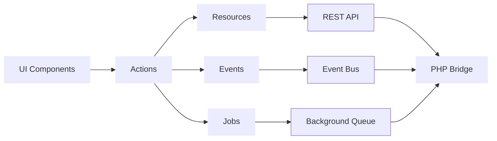
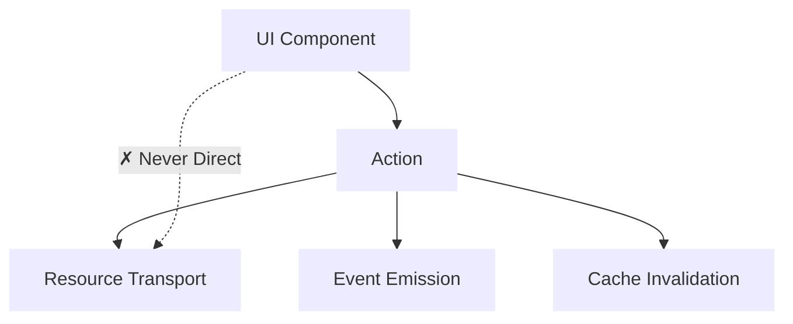

# Philosophy & Architecture

WPKernel is built on a few core principles designed to bring consistency & predictability through modern development practices to the WordPress ecosystem. This guide explains the "why" behind the framework, starting with its most important concept: being **config-first**.

## Why Config-First?

WordPress has always celebrated diversity. There are dozens of ways to register a route, enqueue a script, or render a settings page, and they all work. That openness is part of its strength.

But freedom without guidance can become painfully confusing. When every plugin does the same thing a slightly different way, consistency vanishes, and maintenance becomes a nightmarish task.

WordPress Developers spend more time rediscovering what “works with WordPress” than focusing on what their plugin is actually for.

WPKernel doesn’t try to replace that. It just gives it a **shape**.

### The Config-First Approach

The `wpk.config.ts` file exists for one reason: to express **intent**.

You describe your application's resources, routes, and permissions declaratively. The CLI interprets that intent and emits stable, production-ready artifacts in PHP, TypeScript, and UI form. This code respects WordPress’ conventions but aligns them into a predictable structure.

This approach has two key effects:

1.  **Determinism**: What you describe is what you get. The same config yields identical output anywhere, ensuring parity between development and production.
2.  **Focus**: You spend your energy defining business logic, not re-solving scaffolding and glue code.

### Freedom Through Definition

Being config-first doesn’t mean being locked in. WPKernel’s design deliberately exposes **runtime primitives**, the low-level building blocks that mirror what the generator produces.

If you need to go beyond the config layer, you can import these primitives directly and compose your own controllers, policies, or interactivity logic. The generated code uses the same primitives under the hood, so hand-written modules and generated ones coexist seamlessly.

You can start declaratively, then customize down to the metal without friction.

## Core Architecture: JavaScript-First, PHP-Thin

With the "config-first" principle established, the architecture follows another core idea: **JavaScript is the source of truth, PHP is a thin contract**.

WPKernel embraces the evolution of WordPress:

- **JavaScript** owns business logic, state management, and user interactions.
- **PHP** provides the REST endpoints, capability checks, and server bindings defined by your config.
- A **Bridge** connects the two worlds with a single, well-defined event system.

### The Golden Path

The Golden Path is the mental model for building with WPKernel. Every feature follows this flow, originating from the definitions in your `wpk.config.ts`:

1.  **UI Components** (often auto-generated) trigger user interactions.
2.  **Actions** orchestrate write operations.
3.  **[Resources](./resources.md)** handle data transport and caching against the REST API.
4.  **[Events](./events.md)** notify other parts of the system of changes.
5.  The **PHP Bridge** provides the server-side implementation of the REST API and capabilities.

### Actions-First

A critical rule on the Golden Path is that UI components **never** call the transport layer directly. They always go through an Action. And ensures consistent event emission, cache invalidation, and handling of side effects.

By defining your application in `wpk.config.ts`, you are describing the pieces of this architecture. The WPKernel CLI then generates the code that follows this reliable, predictable path.
