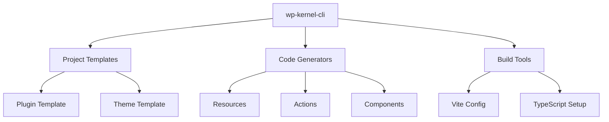

# @geekist/wp-kernel-cli

Command-line interface for scaffolding and managing WP Kernel projects with Rails-like conventions and WordPress best practices.

## Overview

The WP Kernel CLI provides generators, project setup, and development workflow automation. It follows the "convention over configuration" principle to get you building WordPress products quickly.

## Architecture



## Installation

### Global Installation (Recommended)

```bash
npm install -g @geekist/wp-kernel-cli
# or
pnpm add -g @geekist/wp-kernel-cli
```

### One-time Usage

```bash
npx @geekist/wp-kernel-cli init my-project
# or
pnpm dlx @geekist/wp-kernel-cli init my-project
```

## Commands

### Project Initialization

**Create a new plugin:**

```bash
wpk init my-awesome-plugin --template=plugin
cd my-awesome-plugin
```

**Create a new theme:**

```bash
wpk init my-theme --template=theme
cd my-theme
```

**Interactive setup:**

```bash
wpk init
# Prompts for project name, type, features, etc.
```

### Code Generation

**Generate a resource:**

```bash
wpk generate resource Post
# Creates resource definition, types, and tests
```

**Generate an action:**

```bash
wpk generate action CreatePost
# Creates action with orchestration boilerplate
```

**Generate a view component:**

```bash
wpk generate view PostList
# Creates block bindings and interactivity setup
```

**Generate a job:**

```bash
wpk generate job SendNotification
# Creates background job with polling support
```

### Development Workflow

**Start development server:**

```bash
wpk dev
# Starts Vite in watch mode + wp-env
```

**Build for production:**

```bash
wpk build
# Optimized build with WordPress externals
```

**Run tests:**

```bash
wpk test
# Runs unit and E2E tests
```

**Type checking:**

```bash
wpk typecheck
# Validates TypeScript across project
```

## Project Structure

Generated projects follow WordPress and WP Kernel conventions:

```
my-plugin/
├── plugin.php              # Main plugin file
├── package.json            # Node dependencies
├── composer.json           # PHP dependencies
├── vite.config.ts          # Build configuration
├── tsconfig.json           # TypeScript config
├── src/                    # Source code
│   ├── resources/          # Data layer definitions
│   ├── actions/            # Write orchestration
│   ├── views/              # Block bindings & interactivity
│   ├── jobs/               # Background processing
│   └── index.ts            # Entry point
├── includes/               # PHP bridge code
├── __tests__/              # Test files
└── dist/                   # Built assets
```

## Advanced Generator Patterns

### Complete CRUD Feature Generation

The most powerful pattern - generate an entire feature with all necessary files:

```bash
wpk generate feature Job --with=resource,admin-table,actions,tests
```

**Generated Structure:**

```
src/
├── resources/
│   └── job.ts                    # Resource definition with REST routes
├── actions/
│   ├── CreateJob.ts             # Create action with validation
│   ├── UpdateJob.ts             # Update action with optimistic updates
│   ├── DeleteJob.ts             # Delete action with confirmation
│   └── BulkDeleteJobs.ts        # Batch operations
├── admin/
│   ├── pages/
│   │   └── JobsList.tsx         # DataViews-based admin table
│   └── dataviews/
│       └── jobViews.ts          # DataViews field configuration
├── types/
│   └── job.d.ts                 # TypeScript interfaces
└── __tests__/
    ├── resources/
    │   └── job.test.ts          # Resource unit tests
    ├── actions/
    │   └── job-actions.test.ts  # Action integration tests
    └── e2e/
        └── job-admin.spec.ts    # End-to-end admin tests
```

**PHP Bridge Files:**

```
includes/
├── resources/
│   └── class-job-resource.php   # REST API endpoints
└── admin/
    └── class-job-admin.php      # Admin menu registration
```

### Customizable Generation Templates

#### Resource with Custom Options

```bash
wpk generate resource Product \
  --rest-base=products \
  --with-cache \
  --with-events \
  --php-class=Product \
  --capabilities=manage_products
```

**Generated Resource:**

```typescript
// src/resources/product.ts
import { defineResource } from '@geekist/wp-kernel/resource';

export interface Product {
	id: number;
	name: string;
	price: number;
	status: 'draft' | 'published' | 'archived';
	created_at: string;
	updated_at: string;
}

export const product = defineResource<Product>({
	name: 'product',
	routes: {
		list: { path: '/my-plugin/v1/products', method: 'GET' },
		get: { path: '/my-plugin/v1/products/:id', method: 'GET' },
		create: { path: '/my-plugin/v1/products', method: 'POST' },
		update: { path: '/my-plugin/v1/products/:id', method: 'PUT' },
		delete: { path: '/my-plugin/v1/products/:id', method: 'DELETE' },
	},
	cacheKeys: {
		list: (query) => ['product', 'list', query],
		get: (id) => ['product', id],
	},
	events: {
		created: 'wpk.resource.product.created',
		updated: 'wpk.resource.product.updated',
		deleted: 'wpk.resource.product.deleted',
	},
});
```

#### Admin Interface Generation

```bash
wpk generate admin-page ProductsList \
  --resource=Product \
  --features=search,filter,bulk-actions \
  --wp-version=6.7
```

**Generated Admin Page:**

```typescript
// src/admin/pages/ProductsList.tsx
import { DataViews } from '@wordpress/dataviews';
import { useSelect, useDispatch } from '@wordpress/data';
import { SearchControl, SelectControl, Button } from '@wordpress/components';
import { __ } from '@wordpress/i18n';
import { product } from '../../resources/product';
import { DeleteProduct, BulkDeleteProducts } from '../../actions/product';

const fields = [
	{ id: 'name', label: __('Product Name', 'my-plugin'), enableSorting: true },
	{ id: 'price', label: __('Price', 'my-plugin'), enableSorting: true },
	{ id: 'status', label: __('Status', 'my-plugin'), enableSorting: true },
	{
		id: 'created_at',
		label: __('Created', 'my-plugin'),
		enableSorting: true,
	},
];

export default function ProductsListPage() {
	// Complete implementation with search, filters, bulk actions
	// Uses DataViews for WordPress 6.7+, fallback table for older versions
}
```

#### Action Generation with Patterns

```bash
wpk generate action CreateProduct \
  --resource=Product \
  --with=validation,events,jobs,optimistic \
  --permissions=create_products
```

**Generated Action:**

```typescript
// src/actions/CreateProduct.ts
import { defineAction } from '@geekist/wp-kernel/actions';
import { product } from '../resources/product';
import { KernelError } from '@geekist/wp-kernel/error';
import { events } from '@geekist/wp-kernel/events';
import { jobs } from '@geekist/wp-kernel/jobs';

export const CreateProduct = defineAction(
	'CreateProduct',
	async ({ name, price, status = 'draft' }) => {
		// Generated validation
		if (!name?.trim()) {
			throw new KernelError('ValidationError', {
				message: 'Product name is required',
				field: 'name',
			});
		}

		// Permission check
		if (!currentUserCan('create_products')) {
			throw new KernelError('PermissionError', {
				message: 'You cannot create products',
				capability: 'create_products',
			});
		}

		// Optimistic update
		const tempId = `temp-${Date.now()}`;
		product.cache.setItem(tempId, { name, price, status });

		try {
			const created = await product.create({ name, price, status });

			// Remove temp item, add real item
			product.cache.removeItem(tempId);
			product.cache.setItem(created.id, created);

			// Events
			events.emit('wpk.resource.product.created', {
				data: created,
				meta: { userId: getCurrentUserId() },
			});

			// Background job for featured products
			if (status === 'published') {
				await jobs.enqueue('IndexProductForSearch', {
					productId: created.id,
				});
			}

			return created;
		} catch (error) {
			// Revert optimistic update
			product.cache.removeItem(tempId);
			throw error;
		}
	}
);
```

### Template Customization

#### Custom Generator Templates

```bash
# Create custom template
wpk template create my-crud-feature
```

**Template Structure:**

```
.wpk/templates/my-crud-feature/
├── template.config.js           # Template configuration
├── prompts.js                   # Interactive prompts
├── files/
│   ├── resource.ts.hbs         # Handlebars template for resource
│   ├── admin-page.tsx.hbs      # Admin interface template
│   ├── actions/
│   │   ├── create.ts.hbs       # Create action template
│   │   └── update.ts.hbs       # Update action template
│   └── tests/
│       └── e2e.spec.ts.hbs     # E2E test template
└── hooks/
    ├── pre-generate.js         # Pre-generation hooks
    └── post-generate.js        # Post-generation cleanup
```

**Template Configuration:**

```javascript
// .wpk/templates/my-crud-feature/template.config.js
export default {
	name: 'my-crud-feature',
	description: 'Complete CRUD feature with custom patterns',
	prompts: [
		{
			type: 'input',
			name: 'entityName',
			message: 'Entity name (singular):',
			validate: (input) => input.length > 0,
		},
		{
			type: 'multiselect',
			name: 'features',
			message: 'Select features:',
			choices: [
				{ title: 'Admin Table', value: 'admin-table' },
				{ title: 'REST API', value: 'rest-api' },
				{ title: 'Background Jobs', value: 'jobs' },
				{ title: 'Email Notifications', value: 'email' },
			],
		},
	],
	files: {
		'src/resources/{{kebabCase entityName}}.ts': 'resource.ts.hbs',
		'src/admin/pages/{{pascalCase entityName}}List.tsx':
			'admin-page.tsx.hbs',
		// ... other file mappings
	},
};
```

### WordPress Version-Specific Generation

#### Modern WordPress (6.7+) Features

```bash
wpk generate admin-table JobsList \
  --wp-version=6.7 \
  --features=dataviews,script-modules,interactivity
```

Generates code using:

- DataViews for table interface
- Script Modules for loading
- Full Interactivity API features
- Latest @wordpress/components

#### Legacy-Compatible Generation

```bash
wpk generate admin-table JobsList \
  --wp-version=6.5 \
  --fallback-components
```

Generates code using:

- Standard HTML tables with WordPress styling
- Traditional script enqueuing
- Basic @wordpress/components only
- Graceful feature degradation

### Development Workflow Integration

#### Complete Development Setup

```bash
# Initialize project with full toolchain
wpk create my-plugin --template=complete

# Generates:
# - WordPress plugin structure
# - Vite build configuration
# - TypeScript setup with strict mode
# - Jest + Playwright testing setup
# - ESLint + Prettier configuration
# - GitHub Actions CI/CD
# - Development Docker environment
```

#### Incremental Feature Development

```bash
# Start with basic plugin
wpk create my-plugin --template=minimal

# Add features incrementally
wpk add feature User --with=resource,actions
wpk add admin-interface UsersList --resource=User
wpk add background-job SendWelcomeEmail --trigger=user-created
wpk add e2e-tests user-management
```

### Advanced Patterns

#### Multi-Resource Features

```bash
wpk generate feature JobApplication \
  --resources=Job,Application,Candidate \
  --relationships=job-has-many-applications \
  --admin-workflow=application-pipeline
```

#### Plugin-to-Plugin Integration

```bash
wpk generate integration WooCommerce \
  --hooks=woocommerce_order_created \
  --sync-resources=Order,Customer \
  --admin-pages=order-analytics
```

#### Headless/API-First Generation

```bash
wpk generate api-plugin ContentManagement \
  --mode=headless \
  --auth=jwt \
  --resources=Post,Media,User \
  --admin=false
```

## Code Generation

### Resource Generator

```bash
wpk generate resource Post --rest-base=posts
```

Creates:

- `src/resources/Post.ts` - Resource definition
- `src/types/Post.ts` - TypeScript types
- `__tests__/resources/Post.test.ts` - Unit tests
- `includes/resources/class-post.php` - PHP REST endpoints

### Action Generator

```bash
wpk generate action CreatePost --resource=Post
```

Creates:

- `src/actions/CreatePost.ts` - Action orchestration
- `__tests__/actions/CreatePost.test.ts` - Unit tests
- Event emission boilerplate
- Cache invalidation setup

### View Generator

```bash
wpk generate view PostList --block-type=dynamic
```

Creates:

- `src/views/PostList/` - Component directory
- Block binding configuration
- Interactivity API setup
- CSS and template files

## Configuration

### Project Config (`wpk.config.ts`)

```typescript
import { defineConfig } from '@geekist/wp-kernel-cli';

export default defineConfig({
	namespace: 'my-plugin',
	restNamespace: 'my-plugin/v1',
	textDomain: 'my-plugin',
	php: {
		namespace: 'MyPlugin',
		classPrefix: 'MP_',
	},
	build: {
		externals: ['@wordpress/data', '@wordpress/components'],
		cssFramework: 'tailwind', // or 'none'
	},
});
```

### Generator Options

Customize generated code with flags:

```bash
# Generate with custom options
wpk generate resource User \
  --rest-base=users \
  --with-cache \
  --with-events \
  --php-class=User
```

## Integration Features

### TypeScript Setup

- Strict mode enabled
- WordPress type definitions
- Path mapping for clean imports
- Test environment configuration

### Build Configuration

- Vite with WordPress externals
- Tree-shaking optimized
- CSS preprocessing (Sass/PostCSS)
- Asset optimization

### Testing Setup

- Jest for unit tests
- Playwright for E2E tests
- @geekist/wp-kernel-e2e-utils integration
- Coverage reporting

### WordPress Integration

- wp-env configuration
- Plugin/theme headers
- Enqueue scripts setup
- REST API registration

## Development Workflow

### Typical Development Session

```bash
# Start development environment
wpk dev

# Generate new feature
wpk generate resource Product
wpk generate action CreateProduct

# Run tests
wpk test --watch

# Build for deployment
wpk build
```

### Hot Reloading

The CLI sets up hot module replacement for rapid development:

- JavaScript/TypeScript changes reload automatically
- CSS changes apply without page refresh
- PHP changes restart wp-env server

## Deployment

### Production Build

```bash
wpk build --mode=production
```

Generates:

- Minified JavaScript bundles
- Optimized CSS
- Source maps (optional)
- Asset manifest

### Plugin Distribution

```bash
wpk package
```

Creates a deployable plugin zip with:

- Built assets
- PHP files
- Plugin headers
- README and license files

## CLI Development

### Custom Generators

Extend the CLI with custom generators:

```typescript
// generators/custom-generator.ts
import { defineGenerator } from '@geekist/wp-kernel-cli/generator';

export default defineGenerator({
  name: 'custom',
  description: 'Generate custom components',
  templates: [...],
  async generate(options) {
    // Custom generation logic
  },
});
```

### Plugin System

Add functionality via plugins:

```typescript
// wpk.config.ts
import customPlugin from './plugins/custom-plugin';

export default defineConfig({
	plugins: [customPlugin()],
});
```

## Integration Guides

- [Getting Started](/getting-started/) - Installation and setup
- [Quick Start](/getting-started/quick-start) - Create your first project
- [Contributing](/contributing/) - Development workflow

## Related Documentation

- [Resources Guide](/guide/resources) - Understanding resource patterns
- [Actions Guide](/guide/actions) - Action orchestration
