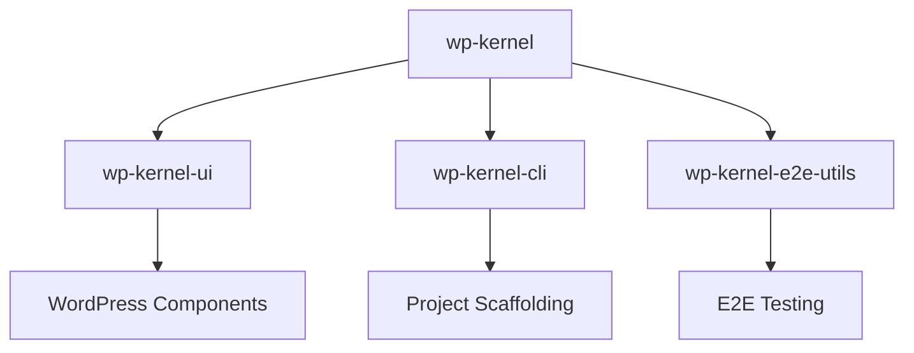

# Packages Overview

WP Kernel is organized into focused packages that work together to provide a complete WordPress development framework. Each package serves a specific purpose and can be used independently or as part of the complete framework.

## Core Packages

### [@geekist/wp-kernel](/packages/kernel)

The foundation package containing resources, actions, events, and jobs. This is the core framework that other packages build upon.

**Key Features:**

- Resource definitions with typed REST contracts
- Action orchestration for write operations
- Canonical event system
- Background job processing

### [@geekist/wp-kernel-ui](/packages/ui)

WordPress-native UI components that integrate seamlessly with WP Kernel patterns and `@wordpress/components`.

**Key Features:**

- DataViews controllers (`ResourceDataView`, `createResourceDataViewController`)
- Action-triggered buttons and forms
- Resource-aware data components
- Block binding utilities and Interactivity helpers

### [@geekist/wp-kernel-cli](/packages/cli)

Command-line tools for scaffolding and managing WP Kernel projects, following Rails-like conventions.

**Key Features:**

- Project initialization
- Resource and action generators
- Development workflow automation
- TypeScript and build tooling setup

### [@geekist/wp-kernel-e2e-utils](/packages/e2e-utils)

Testing utilities built on `@wordpress/e2e-test-utils-playwright` with kernel-specific helpers for comprehensive E2E testing.

**Key Features:**

- WordPress environment setup
- Kernel-aware test fixtures
- Resource and store testing utilities
- Event capture and verification

## Package Architecture



Each package follows the same conventions:

- **Typed APIs** with full TypeScript support
- **Multiple import patterns** (scoped, namespace, flat)
- **WordPress-first** building on core primitives
- **Comprehensive testing** with high coverage requirements

## Installation Patterns

### Complete Framework

```bash
pnpm add @geekist/wp-kernel @geekist/wp-kernel-ui
```

### Development Tools

```bash
pnpm add -D @geekist/wp-kernel-cli @geekist/wp-kernel-e2e-utils
```

### Individual Packages

Each package can be installed independently based on your needs. See individual package documentation for specific installation instructions and peer dependencies.
