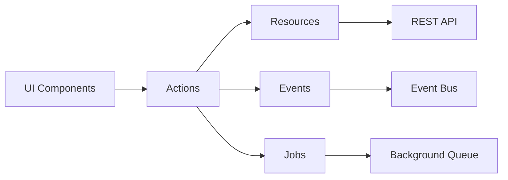

# @geekist/wp-kernel

The core framework package that provides the foundation for modern WordPress development with a Rails-like, opinionated approach.

## Overview

WP Kernel is built on the principle that **JavaScript is the source of truth** while PHP serves as a thin contract layer. This package provides the essential primitives for building scalable WordPress applications.

::: info Canonical source
This page summarises the package README. For the authoritative reference see [packages/kernel/README.md](https://github.com/theGeekist/wp-kernel/blob/main/packages/kernel/README.md).
:::

## Architecture



### Core Principles

1. **Actions-First**: UI components never call transport directly - all writes flow through actions
2. **Typed Resources**: Single definition creates client + store + cache keys + events
3. **Canonical Events**: Stable event taxonomy with JS hooks as the source of truth
4. **Background Jobs**: Polling-based job system with automatic retries

## Key Features

### Bootstrap

`configureKernel()` is the canonical bootstrap. It wires the registry middleware, bridges lifecycle events into `wp.hooks`, and returns a `KernelInstance` with helpers like `getNamespace()`, `getReporter()`, `invalidate()`, `emit()`, and the typed `KernelEventBus` exposed as `kernel.events`.

### Resources

Define your data layer once, get everything you need:

```typescript
import { defineResource } from '@geekist/wp-kernel/resource';

export const post = defineResource({
	name: 'post',
	routes: {
		list: { path: '/wp/v2/posts', method: 'GET' },
		create: { path: '/wp/v2/posts', method: 'POST' },
	},
	cacheKeys: {
		list: (params) => ['post', 'list', JSON.stringify(params)],
		get: (id) => ['post', 'get', id],
	},
});
```

### Actions

Orchestrate write operations with automatic event emission:

```typescript
import { defineAction } from '@geekist/wp-kernel/actions';

export const CreatePost = defineAction({
	name: 'Post.Create',
	handler: async (ctx, { data }) => {
		const result = await post.create(data);
		ctx.emit(post.events.created, { id: result.id });
		ctx.invalidate([post.key('list')]);
		return result;
	},
});
```

### Events

Subscribe to canonical events with type safety:

```typescript
import { events } from '@geekist/wp-kernel/events';

// Framework events always use 'wpk' namespace
events.on('wpk.resource.request', (payload) => {
	console.log('Request started:', payload.requestId);
});

// Resource events use auto-detected namespace
// Pattern: {namespace}.{resourceName}.{action}
events.on('acme-blog.post.created', (payload) => {
	console.log('Post created:', payload.data);
});

// Or use resource events property for type safety
import { post } from './resources/post';
events.on(post.events.created, (payload) => {
	console.log('Post created:', payload.data);
});
```

### Jobs

Process background work with built-in polling:

```typescript
import { defineJob } from '@geekist/wp-kernel/job';

export const SendWelcomeEmail = defineJob({
	name: 'SendWelcomeEmail',
	async execute({ userId }) {
		// Long-running email processing
		await emailService.sendWelcome(userId);
	},
});
```

## Import Patterns

Choose the pattern that fits your project:

### Scoped Imports (Recommended)

```typescript
import { defineResource } from '@geekist/wp-kernel/resource';
import { defineAction } from '@geekist/wp-kernel/actions';
import { KernelError } from '@geekist/wp-kernel/error';
```

### Namespace Imports

```typescript
import { resource, actions, error } from '@geekist/wp-kernel';

const post = resource.defineResource({...});
const CreatePost = actions.defineAction({
        name: 'Post.Create',
        handler: async (ctx, input) => {
                const created = await post.create(input);
                ctx.emit(post.events.created, { id: created.id });
                return created;
        },
});
throw new error.KernelError('ValidationError', {...});
```

### Flat Imports

```typescript
import { defineResource, defineAction, KernelError } from '@geekist/wp-kernel';
```

## API Styles

WP Kernel provides two API styles to suit different preferences:

### Thin-Flat API

Direct method access for simple, straightforward usage:

```typescript
const post = defineResource({ name: 'post' /* ... */ });

// Direct methods
const posts = await post.fetchList();
const singlePost = await post.fetch(123);
await post.create({ title: 'New Post' });
await post.update(123, { title: 'Updated' });
await post.remove(123);

// Cache control
await post.invalidate(['post', 'list']);
post.key('get', 123); // Cache key helper
```

### Grouped API

Organized namespaces for power users and complex applications:

```typescript
const post = defineResource({ name: 'post' /* ... */ });

// Pure selectors (no side effects)
const posts = post.select.list();
const singlePost = post.select.item(123);

// React hooks (from @geekist/wp-kernel-ui)
const { data: posts, isLoading } = post.useList();
const { data: singlePost } = post.useGet(123);

// Explicit fetching (bypass cache)
const freshPosts = await post.get.list();
const freshPost = await post.get.item(123);

// CRUD operations
await post.mutate.create({ title: 'New Post' });
await post.mutate.update(123, { title: 'Updated' });
await post.mutate.remove(123);

// Cache control
await post.cache.prefetch.list({ status: 'draft' });
await post.cache.prefetch.item(123);
post.cache.invalidate.list({ status: 'draft' });
post.cache.invalidate.item(123);
post.cache.invalidate.all();

// Store access
const storeKey = post.storeApi.key;
const storeDescriptor = post.storeApi.descriptor;

// Canonical events
const createdEvent = post.events.created; // {namespace}.post.created
const updatedEvent = post.events.updated; // {namespace}.post.updated
const removedEvent = post.events.removed; // {namespace}.post.removed
```

Both API styles provide the same functionality - choose based on your team's preferences and application complexity.

## Installation

```bash
npm install @geekist/wp-kernel
# or
pnpm add @geekist/wp-kernel
```

### Peer Dependencies

- WordPress 6.8+ (Script Modules API)
- Node.js 22+ (development)

## Integration Guides

- [Getting Started](/getting-started/) - Basic setup and first resource
- [Resources Guide](/guide/resources) - Complete resource documentation
- [Actions Guide](/guide/actions) - Action patterns and best practices
- [Events Guide](/guide/events) - Event system and hooks
- [Jobs Guide](/guide/jobs) - Background processing

## API Reference

- [Resource API](/api/resources) - Complete resource definition reference
- [Action API](/api/actions) - Action creation and execution
- [Event API](/api/events) - Event emission and subscription
- [Job API](/api/jobs) - Background job processing

## WordPress Integration

WP Kernel builds on core WordPress primitives:

- **Script Modules** for modern JavaScript delivery
- **Block Bindings** for data-driven content
- **Interactivity API** for front-end behavior
- **@wordpress/data** for state management
- **REST API** for data transport

## TypeScript Support

Full TypeScript support with strict mode compatibility:

```typescript
// Auto-generated types from your resource definitions
type Post = ResourceType<typeof post>;

// Typed action parameters
const createPost = CreatePost.bind<{ title: string; content: string }>();

// Event payload typing
events.on('wpk.resource.post.created', (payload: PostCreatedPayload) => {
	// payload is fully typed
});
```

## Performance

- **Tree-shakeable**: Import only what you need
- **WordPress externals**: Excludes `@wordpress/*` from bundles
- **Optimistic updates**: Immediate UI feedback
- **Smart caching**: Automatic invalidation on writes
